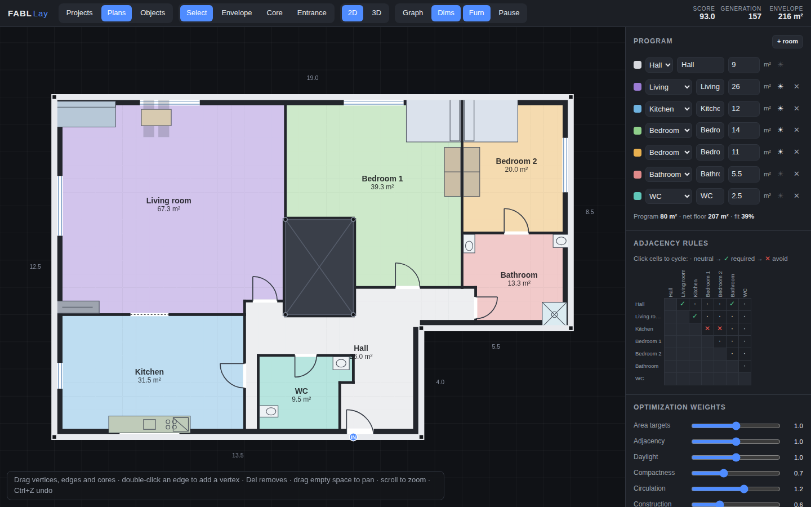
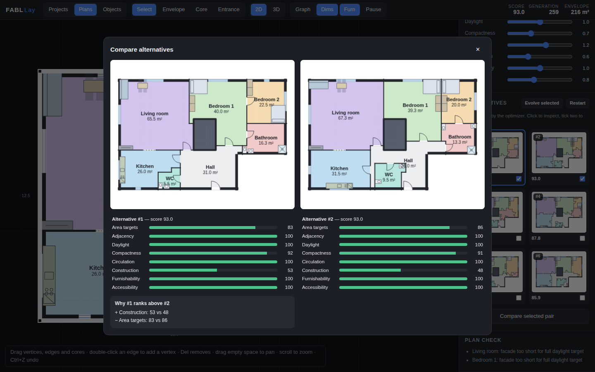

# FABL Lay — Generative Floorplan Studio

An AI-powered generative floorplan application. Sketch the building envelope and
core geometry; the system automatically generates and **continuously evolves**
optimized floorplan layouts using constraints, adjacency rules, snapping,
graph-based relationships, and evolutionary optimization. When walls, cores, or
boundaries are modified, the layout adapts in real time while preserving design
intent. Multiple ranked alternatives can be explored, compared, and evolved
interactively.



## Run it

No dependencies, no build step:

```sh
npm start          # or: node serve.js [port]
```

Then open <http://localhost:8000>. (Any static file server works.)

## Test it on your phone

The app is touch-enabled: one finger sketches/drags, two fingers pinch-zoom
and pan, and on small screens the panel stacks below the canvas.

**Option A — same Wi-Fi (quickest).** Run `npm start` on your computer; it
prints a `http://<your-lan-ip>:8000` URL — open that in your phone's browser
(both devices must be on the same network).

**Option B — public tunnel.** If your phone is not on the same network:

```sh
npm start
npx localtunnel --port 8000        # or: cloudflared tunnel --url http://localhost:8000
```

Open the printed `https://…` URL on your phone.

**Option C — GitHub Pages (no computer needed).** Merging this repo's
`main` triggers `.github/workflows/pages.yml`, which publishes the app to
`https://<user>.github.io/fabl_lay/`. Requires GitHub Pages to be available
for the repo (public repo, or a paid plan for private ones); the site is
public once deployed.

## How to use it

| Tool | What it does |
|---|---|
| **Envelope** (`E`) | Click to place corners; click the first point or press `Enter` to close. Snaps to the 0.5 m grid, existing vertices, and ortho alignments (dashed guides). |
| **Core** (`C`) | Drag a rectangle for stairs / elevator / shaft. Cores are subtracted from the floor area and the hall is rewarded for hugging them. |
| **Entrance** (`N`) | Click an envelope edge. The hall (circulation room) anchors to the entrance. |
| **Select** (`V`) | Drag vertices, edges, cores, the entrance. Double-click an edge to insert a vertex, `Del` removes, `Ctrl+Z` undoes. Drag empty space to pan, scroll to zoom. |

While you edit, the optimizer keeps running: every geometry change is streamed
to the solver, which re-seeds its population from the current elite layouts —
so the plan **adapts instead of restarting**, preserving the spatial logic you
were already converging on.

Right panel:

- **Program** — add/remove rooms, set target areas, toggle ☀ daylight need.
- **Adjacency rules** — click matrix cells to cycle neutral → ✓ required → ✕ avoid.
- **Optimization weights** — rebalance area / adjacency / daylight /
  compactness / circulation live (re-scores instantly).
- **Alternatives** — six ranked, visually-distinct layouts streamed live from
  the optimizer. Click to inspect, **Evolve selected** to breed a fresh
  population around one design, tick two and **Compare** for a side-by-side
  with per-criterion score bars.

Top bar: **Graph** (`G`) overlays the adjacency graph — green = required and
met, red dashed = required and missing, amber = avoid violated, gray = other
achieved connections. **Dims** (`D`) toggles edge dimensions, **Pause**
(`Space`) freezes the optimizer.



## How it works

Everything heavy runs in a **Web Worker**, streaming the top-K distinct
solutions to the UI ~6×/second while the canvas stays at 60 fps.

1. **Rasterization** (`src/solver/grid.js`) — the sketched envelope and cores
   are rasterized into a 0.5 m cell grid; facade cells and core-adjacent cells
   are precomputed.
2. **Genome** (`src/solver/genome.js`) — one seed point + growth weight per
   room. Decoding performs *capacity-constrained multi-source region growing*:
   all rooms flood outward from their seeds through a shared priority queue,
   and expansion gets progressively more expensive once a room exceeds its
   target cell count. The result is always a full, contiguous partition of the
   floor whose areas track the program.
3. **Fitness** (`src/solver/fitness.js`) — each decoded layout is scored 0–100
   on five normalized criteria: area-target deviation, adjacency-rule
   satisfaction (a pair counts as connected only with enough shared wall for a
   door), daylight (rooms flagged ☀ must touch the facade), compactness
   (bounding-box fill + aspect ratio), and circulation (every room must be
   reachable from the hall in the room-connectivity graph; the hall must touch
   the core / entrance).
4. **Evolution** (`src/solver/worker.js`) — a steady-state genetic algorithm
   (population 48, elitism, tournament selection, crossover, gaussian seed
   mutation, room-swap mutation, random immigrants) runs forever in the
   background. The ranked alternatives are the best individuals filtered for
   mutual visual distinctness (≥ 12 % of cells assigned differently).
5. **Design-intent preservation** — on any envelope/core/program edit the
   worker re-rasterizes, remaps elite genomes by room id, clamps seeds into the
   new geometry, and continues evolving from there.

## Development

```sh
npm start                  # serve the app
node test/engine-test.js   # headless smoke test of the layout engine
```

No frameworks, no dependencies — plain ES modules (`src/`), Canvas 2D
rendering, and a Web Worker.
