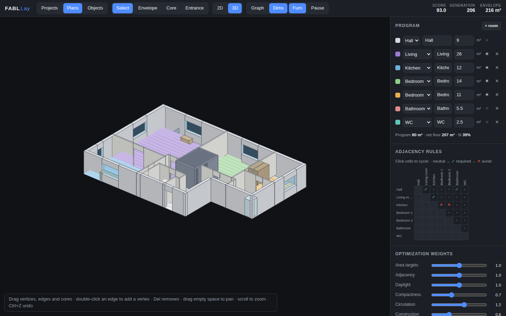

# FABL Lay — Generative Floorplan Studio

An AI-powered generative floorplan application. Sketch the building envelope and
core geometry; the system automatically generates and **continuously evolves**
optimized floorplan layouts using constraints, adjacency rules, snapping,
graph-based relationships, and evolutionary optimization. When walls, cores, or
boundaries are modified, the layout adapts in real time while preserving design
intent. Multiple ranked alternatives can be explored, compared, and evolved
interactively.

Beyond colored room fields, the app synthesizes **real architectural plans**:

- **Walls** with actual thickness, classified exterior / interior / core
- **Doors as rule objects** — each knows its wall, the two rooms it connects,
  its swing side and the clearance it requires; required adjacencies that
  aren't on the circulation tree become wide cased openings
- **Windows as rule objects** — sized from a glazing target (~12 % of floor
  area), placed on the room's facade runs, away from corners and the entrance
- **Furniture families with metadata** — beds, wardrobes, sofa/TV pairs,
  dining tables, kitchen runs with sink/hob/fridge work zones, toilets, basins,
  showers, desks. The auto-furnisher places them from room type, walls,
  clearances and snap rules (toilets snap to wet walls, tall items avoid
  windows, nothing blocks a door swing). Custom families can be imported as
  JSON under **Objects**
- **3D validation view** — dependency-free axonometric rendering of walls at
  real height with door/window openings, room volumes and furniture
- **Projects / Plans / Objects** structure with a local project library


## Run it

No dependencies, no build step:

```sh
npm start          # or: node serve.js [port]
```

Then open <http://localhost:8000>. (Any static file server works.)

## Test it on your phone

The app is touch-enabled: one finger sketches/drags, two fingers pinch-zoom
and pan, and on small screens the panel stacks below the canvas.

**Option A — same Wi-Fi (quickest).** Run `npm start` on your computer; it
prints a `http://<your-lan-ip>:8000` URL — open that in your phone's browser
(both devices must be on the same network).

**Option B — public tunnel.** If your phone is not on the same network:

```sh
npm start
npx localtunnel --port 8000        # or: cloudflared tunnel --url http://localhost:8000
```

Open the printed `https://…` URL on your phone.

**Option C — GitHub Pages (no computer needed).** The app is published at
<https://dogancanka.github.io/fabl_lay/>. It is served from the `gh-pages`
branch, which `.github/workflows/pages.yml` re-syncs from `main` on every
push — so merging to `main` re-deploys automatically. Note the site is
public.

## How to use it

| Tool | What it does |
|---|---|
| **Envelope** (`E`) | Click to place corners; click the first point or press `Enter` to close. Snaps to the 0.5 m grid, existing vertices, and ortho alignments (dashed guides). |
| **Core** (`C`) | Drag a rectangle for stairs / elevator / shaft. Cores are subtracted from the floor area and the hall is rewarded for hugging them. |
| **Entrance** (`N`) | Click an envelope edge. The hall (circulation room) anchors to the entrance. |
| **Select** (`V`) | Drag vertices, edges, cores, the entrance. Double-click an edge to insert a vertex, `Del` removes, `Ctrl+Z` undoes. Drag empty space to pan, scroll to zoom. |

While you edit, the optimizer keeps running: every geometry change is streamed
to the solver, which re-seeds its population from the current elite layouts —
so the plan **adapts instead of restarting**, preserving the spatial logic you
were already converging on.

Right panel:

- **Program** — add/remove rooms, set target areas, toggle ☀ daylight need.
- **Adjacency rules** — click matrix cells to cycle neutral → ✓ required → ✕ avoid.
- **Optimization weights** — rebalance area / adjacency / daylight /
  compactness / circulation live (re-scores instantly).
- **Alternatives** — six ranked, visually-distinct layouts streamed live from
  the optimizer. Click to inspect, **Evolve selected** to breed a fresh
  population around one design, tick two and **Compare** for a side-by-side
  with per-criterion score bars.

Top bar: **Graph** (`G`) overlays the adjacency graph — green = required and
met, red dashed = required and missing, amber = avoid violated, gray = other
achieved connections. **Dims** (`D`) toggles edge dimensions, **Pause**
(`Space`) freezes the optimizer.




## How it works

Everything heavy runs in a **Web Worker**, streaming the top-K distinct
solutions to the UI ~6×/second while the canvas stays at 60 fps.

1. **Rasterization** (`src/solver/grid.js`) — the sketched envelope and cores
   are rasterized into a 0.5 m cell grid; facade cells and core-adjacent cells
   are precomputed.
2. **Genome** (`src/solver/genome.js`) — one seed point + growth weight per
   room. Decoding performs capacity-constrained multi-source region growing
   prioritized by *weighted Chebyshev distance* (Chebyshev balls are squares,
   so contested room boundaries come out axis-aligned and buildable).
3. **GA fitness** (`src/solver/fitness.js`) — area targets, adjacency rules
   (door-able shared wall), daylight, compactness, circulation reachability
   and construction logic (corner/junction density of interior walls).
4. **Evolution** (`src/solver/worker.js`) — steady-state genetic algorithm
   (population 48, elitism, tournament selection, crossover, gaussian seed
   mutation, room swaps, random immigrants), running forever. On any
   envelope/core/program edit the worker re-rasterizes, remaps elite genomes
   by room id and continues evolving — design intent is preserved.
5. **Architectural synthesis** (`src/solver/synthesize.js`) — each presented
   alternative is turned into a buildable plan: boundary relaxation straightens
   walls (`walls.js`), wall segments are extracted with thickness and
   classification, doors are placed on a BFS circulation tree from the hall
   (`openings.js`), windows on facade runs, and furniture via the rule-based
   auto-furnisher (`furnish.js`) using the family catalog
   (`src/model/families.js`). Synthesis adds the **furnishability** and
   **accessibility** criteria, and the combined 8-criterion score determines
   the final ranking. The compare view explains *why* one alternative ranks
   above another.
6. **Rendering** — `src/render-plan.js` draws the architectural 2D plan
   (poché walls, door swings, window symbols, furniture symbols);
   `src/view3d.js` renders the dependency-free axonometric 3D view with a
   painter's algorithm.

## Development

```sh
npm start    # serve the app
npm test     # headless engine + synthesis smoke tests
```

No frameworks, no dependencies — plain ES modules (`src/`), Canvas 2D
rendering, and a Web Worker.
